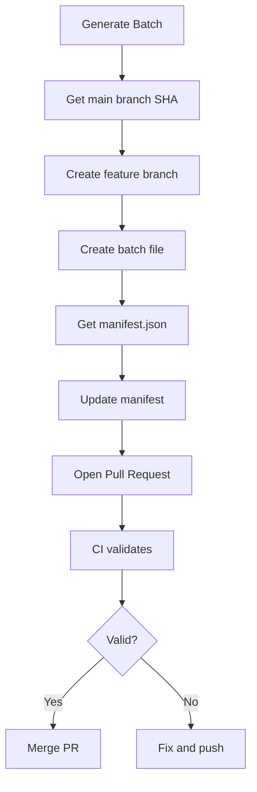

# Custom GPT Actions - GitHub Integration

This document provides exact instructions for configuring a Custom GPT to automatically generate content batches and open pull requests on GitHub.

---

## Overview

The Custom GPT will:
1. Generate a new glossary term batch
2. Create a feature branch
3. Commit the batch file
4. Update the manifest
5. Open a pull request
6. CI will automatically validate the content

---

## GitHub API Endpoints

### Base URL
```
https://api.github.com
```

### Authentication
Use a GitHub Personal Access Token (PAT) with these scopes:
- `repo` (full repository access)
- `workflow` (trigger workflows)

**Header:**
```
Authorization: Bearer YOUR_GITHUB_TOKEN
```

---

## API Operations

### 1. Get File Content

**Endpoint:**
```
GET /repos/{owner}/{repo}/contents/{path}
```

**Example:**
```
GET /repos/ChrisFlow/flightmanager/contents/data/manifest.json
```

**Response:**
```json
{
  "name": "manifest.json",
  "path": "data/manifest.json",
  "sha": "abc123...",
  "content": "base64-encoded-content",
  "encoding": "base64"
}
```

**Decode content:**
```javascript
const content = Buffer.from(response.content, 'base64').toString('utf-8');
const manifest = JSON.parse(content);
```

---

### 2. Get Default Branch Reference

**Endpoint:**
```
GET /repos/{owner}/{repo}/git/ref/heads/{branch}
```

**Example:**
```
GET /repos/ChrisFlow/flightmanager/git/ref/heads/main
```

**Response:**
```json
{
  "ref": "refs/heads/main",
  "object": {
    "sha": "def456...",
    "type": "commit"
  }
}
```

---

### 3. Create New Branch

**Endpoint:**
```
POST /repos/{owner}/{repo}/git/refs
```

**Body:**
```json
{
  "ref": "refs/heads/content/2025-10-30-batch-001",
  "sha": "def456..."  // SHA from step 2
}
```

**Branch naming convention:**
```
content/<YYYY-MM-DD>-batch-<###>
```

---

### 4. Create or Update File

**Endpoint:**
```
PUT /repos/{owner}/{repo}/contents/{path}
```

**Example (Create batch file):**
```
PUT /repos/ChrisFlow/flightmanager/contents/data/batches/2025-10-30-batch-001.json
```

**Body:**
```json
{
  "message": "chore(content): add 2025-10-30-batch-001",
  "content": "base64-encoded-json-content",
  "branch": "content/2025-10-30-batch-001"
}
```

**Encode content:**
```javascript
const content = Buffer.from(JSON.stringify(batchData, null, 2)).toString('base64');
```

---

### 5. Update Manifest

**Endpoint:**
```
PUT /repos/{owner}/{repo}/contents/data/manifest.json
```

**Body:**
```json
{
  "message": "chore(content): update manifest for batch-001",
  "content": "base64-encoded-manifest-content",
  "branch": "content/2025-10-30-batch-001",
  "sha": "abc123..."  // SHA from GET manifest (step 1)
}
```

**Important:** Must include the current file SHA to avoid conflicts.

---

### 6. Create Pull Request

**Endpoint:**
```
POST /repos/{owner}/{repo}/pulls
```

**Body:**
```json
{
  "title": "feat: Add aviation glossary batch 001 (Navigation)",
  "body": "## New Content Batch\n\n**Batch ID:** 2025-10-30-batch-001\n**Terms:** 4\n**Categories:** Navigation, Safety\n\n### Terms Added:\n- Term 1\n- Term 2\n- Term 3\n- Term 4\n\n### Validation:\n- [x] Schema validation passed\n- [x] Plain text only (no markdown)\n- [x] All categories have 4+ terms\n- [x] All relationship references valid\n\n🤖 Generated with Custom GPT",
  "head": "content/2025-10-30-batch-001",
  "base": "main"
}
```

**Title format:**
```
feat: Add aviation glossary batch <###> (<Primary Category>)
```

---

## Complete Workflow

### Step-by-Step Process



### Pseudocode

```javascript
async function submitBatch(batchData) {
  const owner = 'ChrisFlow';
  const repo = 'flightmanager';
  const batchId = '2025-10-30-batch-001';
  const branchName = `content/${batchId}`;

  // 1. Get main branch SHA
  const mainRef = await github.get(`/repos/${owner}/${repo}/git/ref/heads/main`);
  const baseSha = mainRef.object.sha;

  // 2. Create feature branch
  await github.post(`/repos/${owner}/${repo}/git/refs`, {
    ref: `refs/heads/${branchName}`,
    sha: baseSha
  });

  // 3. Create batch file
  const batchPath = `data/batches/${batchId}.json`;
  const batchContent = Buffer.from(JSON.stringify(batchData, null, 2)).toString('base64');

  await github.put(`/repos/${owner}/${repo}/contents/${batchPath}`, {
    message: `chore(content): add ${batchId}`,
    content: batchContent,
    branch: branchName
  });

  // 4. Get current manifest
  const manifestResponse = await github.get(`/repos/${owner}/${repo}/contents/data/manifest.json`);
  const manifestContent = Buffer.from(manifestResponse.content, 'base64').toString('utf-8');
  const manifest = JSON.parse(manifestContent);

  // 5. Update manifest
  manifest.batches.push({
    id: batchId,
    path: batchPath,
    createdAt: new Date().toISOString(),
    termCount: batchData.terms.length,
    categories: [...new Set(batchData.terms.map(t => t.category))]
  });

  const updatedManifestContent = Buffer.from(JSON.stringify(manifest, null, 2)).toString('base64');

  await github.put(`/repos/${owner}/${repo}/contents/data/manifest.json`, {
    message: `chore(content): update manifest for ${batchId}`,
    content: updatedManifestContent,
    branch: branchName,
    sha: manifestResponse.sha
  });

  // 6. Create PR
  const pr = await github.post(`/repos/${owner}/${repo}/pulls`, {
    title: `feat: Add aviation glossary batch ${batchId}`,
    body: generatePRBody(batchData, batchId),
    head: branchName,
    base: 'main'
  });

  return pr;
}
```

---

## PR Body Template

```markdown
## New Content Batch

**Batch ID:** {batchId}
**Terms:** {termCount}
**Categories:** {categories}

### Terms Added:
{termList}

### Validation:
- [ ] Schema validation passed
- [ ] Plain text only (no markdown)
- [ ] All categories have 4+ terms
- [ ] All relationship references valid
- [ ] Official sources cited

### Sources:
{sourceList}

🤖 Generated with Custom GPT
```

---

## Error Handling

### Common Errors

**409 Conflict (Branch exists):**
```json
{
  "message": "Reference already exists",
  "documentation_url": "..."
}
```

**Solution:** Use a different batch ID or delete the existing branch.

**422 Validation Failed (Missing SHA):**
```json
{
  "message": "sha is required when updating a file"
}
```

**Solution:** Get the current file SHA before updating.

**404 Not Found (File doesn't exist):**
```json
{
  "message": "Not Found"
}
```

**Solution:** Ensure the path is correct and the file exists on the specified branch.

---

## Rate Limits

GitHub API has rate limits:
- **Authenticated:** 5,000 requests/hour
- **Unauthenticated:** 60 requests/hour

**Check rate limit:**
```
GET /rate_limit
```

---

## Security Best Practices

1. **Never commit PAT to code** - Use environment variables
2. **Use fine-grained PATs** - Limit to specific repository
3. **Set expiration** - PATs should expire after 90 days
4. **Rotate tokens** - Regularly update tokens
5. **Minimal scopes** - Only grant necessary permissions

---

## Testing

### Test Endpoints Locally

```bash
# Set token
export GITHUB_TOKEN="your-token-here"

# Get manifest
curl -H "Authorization: Bearer $GITHUB_TOKEN" \
  https://api.github.com/repos/ChrisFlow/flightmanager/contents/data/manifest.json

# Get branch ref
curl -H "Authorization: Bearer $GITHUB_TOKEN" \
  https://api.github.com/repos/ChrisFlow/flightmanager/git/ref/heads/main
```

---

## Manifest Update Script

See `scripts/update-manifest.ts` for a standalone script to update the manifest.

**Usage:**
```bash
npm run update-manifest data/batches/2025-10-30-batch-001.json
```

This script:
1. Reads the batch file
2. Extracts metadata (termCount, categories)
3. Updates `data/manifest.json`
4. Sorts batches by date

---

## Custom GPT Configuration

### Actions Schema

```yaml
openapi: 3.0.0
info:
  title: Flight Manager Content API
  version: 1.0.0

servers:
  - url: https://api.github.com

paths:
  /repos/{owner}/{repo}/contents/{path}:
    get:
      operationId: getFile
      summary: Get file content
      parameters:
        - name: owner
          in: path
          required: true
          schema:
            type: string
        - name: repo
          in: path
          required: true
          schema:
            type: string
        - name: path
          in: path
          required: true
          schema:
            type: string

    put:
      operationId: createOrUpdateFile
      summary: Create or update file
      parameters:
        - name: owner
          in: path
          required: true
          schema:
            type: string
        - name: repo
          in: path
          required: true
          schema:
            type: string
        - name: path
          in: path
          required: true
          schema:
            type: string
      requestBody:
        required: true
        content:
          application/json:
            schema:
              type: object
              properties:
                message:
                  type: string
                content:
                  type: string
                branch:
                  type: string
                sha:
                  type: string

  /repos/{owner}/{repo}/pulls:
    post:
      operationId: createPullRequest
      summary: Create pull request
      parameters:
        - name: owner
          in: path
          required: true
          schema:
            type: string
        - name: repo
          in: path
          required: true
          schema:
            type: string
      requestBody:
        required: true
        content:
          application/json:
            schema:
              type: object
              properties:
                title:
                  type: string
                body:
                  type: string
                head:
                  type: string
                base:
                  type: string
```

---

## Next Steps

1. Create GitHub Personal Access Token
2. Configure Custom GPT with Actions schema
3. Test with a small batch
4. Monitor CI validation results
5. Merge successful PRs

---

**Last Updated:** 2025-10-30
**API Version:** GitHub REST API v3
**Authentication:** Personal Access Token (PAT)
